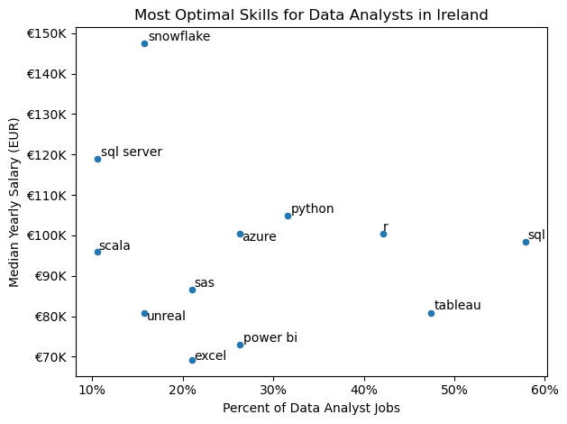
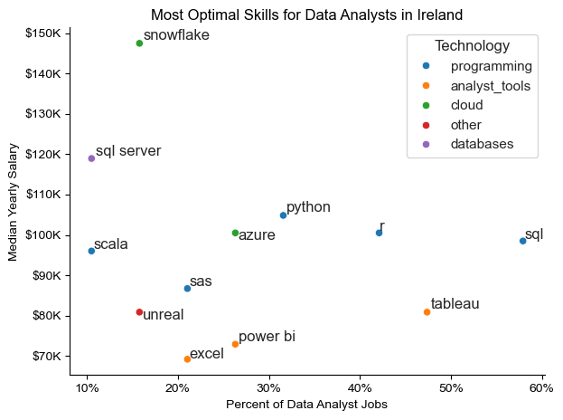

# Overview

Welcome to my analysis of the data job market, focusing on data analyst roles. This project was created out of a desire to navigate and understand the job market more effectively. It looks into the top-paying and in-demand skills to help find optimal job opportunities for data analysts. 

The data sourced form [Luke Barousse's Python Course](https://github.com/lukebarousse/Python_Data_Analytics_Course) which provides a foundation for my analysis, containing detailed information on job titles, salaries, locations, and essential skills. Through a series of Python scripts, I explore key questions such as the most demanded skills, salary trends, and the intersection of demand and salary in data analytics. 


# The Questions

Below are questions I want to answer in my project:

1. What are the skills most in demand for the top 3 most popular data roles?
2. How are in-demand skills trending for Data Analysts?
3. How well do jobs and skills pay for Data Analysts?
4. What are the optimal skills for data analysts to learn (High Demand AND High Paying)


# Tools I used 

For my deep dive into the data analyst job market, I harnessed the power of several key tools:

- Python: The backbone of my analysis, allowing me to analyse the data and find critical insights. I also used the following Python libraries:
    - Pandas Library: This was used to analyse the data.
    - Matplotlib Library: I visualised the data.
    - Seaborn Library: Helped me create more advanced visuals.
- Jupyter Notebooks: The tool I used to run my Python scripts which let me easily include my notes and analysis.
- Visual Studio (VS) Code: My go-to for executing my Python scripts.
- Git & GitHub: Essential for version control and sharing my Python code and analysis, ensuring collaboration and project tracking.

# Data Preparation and Cleanup 

This section outlines the steps taken to prepare the data for data analysis, ensuring accuracy and usability.

## Import & Clean Up Data

I start by importing necessary libraries and loading the dataset, follwed by initial data cleaning tasks to ensure data quality.

```python
# Importing Libraries
import ast
import pandas as pd
import seaborn as sns
from datasets import load_dataset
import matplotlib.pyplot as plt  

# Loading Data
dataset = load_dataset('lukebarousse/data_jobs')
df = dataset['train'].to_pandas()

# Data Cleanup
df['job_posted_date'] = pd.to_datetime(df['job_posted_date'])
df['job_skills'] = df['job_skills'].apply(lambda x: ast.literal_eval(x) if pd.notna(x) else x)
```

## Filter Irish Jobs
To focus my analysis on the Irish job market, I apply filters to the dataset, narrowing down to roles based in Ireland. 

``` python
df_IRE = df[df['job_country'] == 'Ireland']
```

# The Analysis
Each Jupter notebook for this project aimed at investigating specific aspects of the data job market. Here's how I approached each question: 

## 1. What are the most demanded skills for the top 3 most popular data roles?

To find the most demanded skills for the top 3 most popular data roles, I filtered out those positions by which ones were the most popular, and got the top 5 skills for these top 3 roles. This query highlights the most popular job titles and their top skills, showing which skills I should pay attention to depending on the role I'm targeting.

View my notebook with detailed steps here:
[2_Skill_Demand](./2_Skills_Count.ipynb).

### Visualise Data
````python 
fig, ax = plt.subplots(len(job_titles), 1)

for i, job_title in enumerate(job_titles):
    df_plot = df_skills_perc[df_skills_perc['job_title_short'] == job_title].head(5)
    sns.barplot(data=df_plot, x='skill_percent', y='job_skills', ax=ax[i], hue='skill_count', palette='dark:b_r')
    
plt.show()
````

### Results


### Insights

- Python is a versatile skill, highly demanded across all three roles, but most prominently for Data Scientists (53%) and Data Engineers (50%).
- SQL is the most requested skill for Data Analysts and Data Engineers, with it in over half the job postings across both roles. For Data Scientists, Python is the most sought-after skill, appearing in 53% of job postings.
- Data Engineers require more specialised technical skills (AWS, Azure, Spark) compared to Data Analysts and Daata Scientists who are expected to be proficient in more general data management and analysis tools (Excel, Tableau).


## 2. How are in-demand skills trending for Data Scientists?

To find how skills are trending in 2023 for Data Analysts, I fitered data analyst positions and grouped the skills by the month of the job postings. This got me the top 5 skills of data analysts by month, showing how popular skills were throughout 2023.

View my notebook with detailed steps here: [3_Skills_Trend](./3_Skills_Trend.ipynb). 

### Visualise Data

```python

from matplotlib.ticker import PercentFormatter

df_plot = df_DA_IRE_percent.iloc[:, :5]
sns.lineplot(data=df_plot, dashes=False, legend='full', palette='tab10')

plt.gca()yaxis.set_major_formatter(PercentFormatter(decimals=0))

plt.show()

```

### Results


*Bar graph visualising the trending top skills for data analysts in Ireland in 2023.*

### Insights
- SQL remains the most consistently demanded skill throughout the year.
- Excel experienced a significant increase in demand starting around September, although it was surpassed by both Python and Tableau by the end of the year
- Both Python and Teableau show  several fluctuations in demand throughout the year but remain essential skills for data analysts. Power BI, while less demanded compared to other, shows a slight upward trend towards the year's end.


## 3. How well do jobs and skills pay for Data Analysts?

To identify the highest-paying roles and skills, I only got jobs in Ireland and looked at their median salary. But first I looked at the salary distributions of common data jobs like Data Scientist, Data Engineer, and Data Analyst, to get an idea of which jobs aer paid the most. 

View my notebook with detailed steps here: [4_Salary_Analysis](./4_Salary_Analysis.ipynb).

#### Visualise Data

```python
sns.boxplot(data=df_IRE_top6, x='salary_year_avg', y='job_title_short', order=job_order)

ticks_x = plt.FuncFormatter(lambda y, pos: f'€{int(y/1000)}K')
plt.gca().xaxis.set_major_formatter(ticks_x)
plt.show()

```


#### Results


*Box plot visualising the salary distributions for the top 6 data job titles.*

#### Insights
- There's a significant variation in salary ranges across different job titles. Machine Learning Engineers tend to have the highest salary potential, with up to €175K, indicating the high value placed on machine learning skills in the industry.
- Senior Data Engineer and Data Analyst roles show a number of outliers on the higher end of the salary spectrum, suggesting that exceptional skills or circumstances can lead to high pay in these roles. In contrast, Data Scientist roles demonstrate more consistency in salary, with no outliers.
- The median salaries increase with seniority and specialisation of the roles. 


### Highest Paid & Most Demanded Skills for Data Analysts

Next, I narrowed my analysis and focused only on data analyst roles. I looked at the highest-paid skills and the most in-demand skills. I used two bar charts to showcase these.

#### Visualise Data

```python

fig, ax = plt.subplots(2, 1)  

# Top 10 Highest Paid Skills for Data Analysts
sns.barplot(data=df_DA_top_pay, x='median', y=df_DA_top_pay.index, ax=ax[0], hue='median', palette='dark:b_r')

# Top 10 Most In-Demand Skills for Data Analysts
sns.barplot(data=df_DA_skills, x='median', y=df_DA_skills.index, ax=ax[1], hue='median', palette='light:b')

plt.show()

```
#### Results
Here's the breakdown of the highest-paid & most in-demand skills for data analysts in Ireland:


*Two separate bar graphs visualising the highest paid skills and most in-demand skills for data analysts in Ireland.*

#### Insights

- The top graph shows speciailised technical skills like `git`, `linux`, and `oracle` are associated with higher salaries, some reaching up to €200K,suggesting that advaced technical proficiency can increase earning potential.

- The bottom graph highlights that foundational skills like `Excel` and `SQL` are the most in-demand, even though they may mot offer the highest salaries. This demonstrates the importance of these core skills for employability in data analyst roles.

- There's a clear distinction between the skills that are paid the highest and those that are the most in-demand. Data analysts aiming to maximise their career potential should consider developing a diverse skill set that includes both high-paying specialised skills and widely-demanded foundational skills. 


## 4. What is the most optimal skill to learn for Data Analysts?

To identify the most optimal skills to learn (the ones that are the highest paid and highest in demand) I calculated the percent of skill demand and the median salary of these skills. To easily identify which are the most optimal to learn.

View my notebook with detailed steps here: [5_Optimal_Skills](./5_Optimal_Skills.ipynb). 

#### Visualise Data

```python
from adjustText import adjust_text
import matplotlib.pyplot as plt

plt.scatter(df_DA_skills_high_demand['skill_percent'], df_DA_skills_high_demand['median_salary'])
plt.show()
```

#### Results


#### Insights
- The skill `snowflake` appears to have the highest mean salary of nearly €150K, despite being less common in job postings. This suggests a high value placed on specialised database skills within the data analyst profession.

- More commonly required skills like `SQL` and `R` have a large presence in job listings but lower median salaries compared to specialised skills like `Python`and `Azure`, which not only have higher salaries but are also moderately prevalent in job listings.

- Skills such as `Python`, `R`, and `SQL` are towards the higher end of the salary specturm while also being fairly common in job listings, indicating that proficiency in these tools can lead to good opportunities in data analytics.

### Visualising Different Technologies

I visualised the different technologies as well in the graph. I added colour labels based on the technology e.g. ({Programming: Python})

#### Visualise Data

```python
from matplotlib.ticker import PercentFormatter

# Create a scatter plot
scatter = sns.scatterplot(
    data=df_DA_skills_tech_high_demand,
    x='skill_percent',
    y='median_salary',
    hue='technology',  # Color by technology
    palette='bright',  # Use a bright palette for distinct colors
    legend='full'  # Ensure the legend is shown
)
plt.show()
```

#### Results

*A scatter plot visualising the most optimal skills (high paying & high demand) for data analysts in Ireland.*

#### Insights
- The scatter plot shows that most of the `programming` skills (coloured blue) tend to cluster at higher salary levels compared to other categories, indicating that programming experitse might offer greater salary benefits within the data analytics field.

- Analyst tools (coloured orange), including Tableau, are prevalent in job postings and offer competitive salaries, showing that visualisation and data analysis software are crucial for current data roles. This category not only has good salaries but is also versatile across different types of data tasks.

- The cloud skills (coloured green), such as Azure and Snowflake, are associated with some of the highest salaries among data analyst tools, despite being lower in demand.

# What I learned

Throughout this project, I deepened my understanding of the data analyst job market and enhanced my technical skills in Python, espcially in data manipulation and visualisation. Here are a few specific things I learned:

- Advanced Python Usage: Utilising libraries such as Pandas for data manipulation, Seaborn and Matplotlib for data visualisation, and other libraries helped me perform complex data analysis tasks more efficiently.

- Data Cleaning Importance: I learned that thorough data cleaning and preparation are crucial before any analysis can be conducted, ensuring the accuracy of insights derived from the data.

- Strategic Skill Analysis: The project emphasised the importance of aligning one's skills with market demand. Understanding the relationship between skill demand, salary, and job availability allows for more strategic career planning in the tech industry.

# Insights

This project provided several general insights into thte data job market for analysts:

- Skill Demand and Salary Correlation: There is a clear correlation between the demand for specific skills and th esalaries these skills command. Advanced and specialised skills like Python and Snowflake often lead to higher salaries.

- Market Trends: There are changing trends in skill demand, highlighting the dynamic nature of the data job market. Keeping up with these trends is essential for career growth in data analytics.

- Economic Value of Skilles: Understanding which skills are both in-demand and well-compensated can guide data analysts in prioritising learning to maximise their economic returns. 

# Challenges I Faced

This project was not without its challenges, but it provided good learning opportunities:

- Data Inconsistencies: Handling missing or inconsistent data entries requires careful consideration and thorough data-cleaning techniques to ensure the integrity of the analysis.

- Complex Data Visualisation: Designing effective visual representations of complex datasets was challenging but critical for conveying insights clearly and compellingly.

- Balancing Breadth and Depth: Deciding how deeply to look into each analysis while maintaining a broad overview of the data landscape required constant balancing to ensure comprehensive coverage without getting lost in details.

# Conclusion

This exploration into the data analyst job market has been incredibly informative, highlighting the critical skills and trends that shape this evolving field. The insights I got enhance my understanding and provide actionable guidance for anyone looking to advance their career in data analytics. As the market continues to change, ongoing analysis will be essential to stay ahead in data analytics. This project is a good foundation for future explorations and underscores the importance of continuous learning and adaptation in the data field.