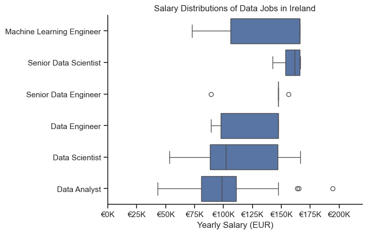
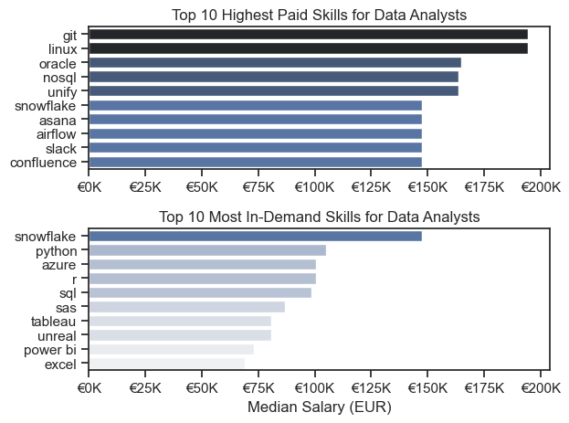

# The Analysis

## 1. What are the most demanded skills for the top 3 most popular data roles?

To find the most demanded skills for the top 3 most popular data roles, I filtered out those positions by which ones were the most popular, and got the top 5 skills for these top 3 roles. This query highlights the most popular job titles and their top skills, showing which skills I should pay attention to depending on the role I'm targeting.

View my notebook with detailed steps here:
[2_Skill_Demand.ipynb](3_Project\2_Skills_Count.ipynb)

### Visualise Data
````python 
fig, ax = plt.subplots(len(job_titles), 1)

for i, job_title in enumerate(job_titles):
    df_plot = df_skills_perc[df_skills_perc['job_title_short'] == job_title].head(5)
    sns.barplot(data=df_plot, x='skill_percent', y='job_skills', ax=ax[i], hue='skill_count', palette='dark:b_r')
    
plt.show()
````

### Results


### Insights

- Python is a versatile skill, highly demanded across all three roles, but most prominently for Data Scientists (53%) and Data Engineers (50%).
- SQL is the most requested skill for Data Analysts and Data Engineers, with it in over half the job postings across both roles. For Data Scientists, Python is the most sought-after skill, appearing in 53% of job postings.
- Data Engineers require more specialised technical skills (AWS, Azure, Spark) compared to Data Analysts and Daata Scientists who are expected to be proficient in more general data management and analysis tools (Excel, Tableau).


## 2. How are in-demand skills trending for Data Scientists?

### Visualise Data

```python

from matplotlib.ticker import PercentFormatter

df_plot = df_DA_IRE_percent.iloc[:, :5]
sns.lineplot(data=df_plot, dashes=False, legend='full', palette='tab10')

plt.gca()yaxis.set_major_formatter(PercentFormatter(decimals=0))

plt.show()

```

### Results


*Bar graph visualising the trending top skills for data scientists in Ireland in 2023.*

### Insights
- Python remains the most consistently demanded skill throughout the year.
- SQL experienced a significant decrease in demand starting around May but surpassed both R and Tableau by the end of the year.
- Both Tableau and and Power Bi show relatively similar demand throughout the year with some fluctuations but remain essential skills for data scientists. 


## 3. How well do jobs and skills pay for Data Analysts?

### Salary Analysis 

#### Visualise Data

```python
sns.boxplot(data=df_IRE_top6, x='salary_year_avg', y='job_title_short', order=job_order)

ticks_x = plt.FuncFormatter(lambda y, pos: f'€{int(y/1000)}K')
plt.gca().xaxis.set_major_formatter(ticks_x)
plt.show()

```


#### Results


*Box plot visualising the salary distributions for the top 6 data job titles.*

#### Insights
- There's a significant variation in salary ranges across different job titles. Machine Learning Engineers tend to have the highest salary potential, with up to €175K, indicating the high value placed on machine learning skills in the industry.
- Senior Data Engineer and Data Analyst roles show a number of outliers on the higher end of the salary spectrum, suggesting that exceptional skills or circumstances can lead to high pay in these roles. In contrast, Data Scientist roles demonstrate more consistency in salary, with no outliers.
- The median salaries increase with seniority and specialisation of the roles. 


### Highest Paid & Most Demanded Skills for Data Analysts

#### Visualise Data

```python

fig, ax = plt.subplots(2, 1)  

# Top 10 Highest Paid Skills for Data Analysts
sns.barplot(data=df_DA_top_pay, x='median', y=df_DA_top_pay.index, ax=ax[0], hue='median', palette='dark:b_r')

# Top 10 Most In-Demand Skills for Data Analysts
sns.barplot(data=df_DA_skills, x='median', y=df_DA_skills.index, ax=ax[1], hue='median', palette='light:b')

plt.show()

```
#### Results
In-demand skills for Data Analysts in Ireland:


*Two separate bar graphs visualising the highest paid skills and most in-demand skills for data analysts in Ireland.*

#### Insights

- The top graph shows speciailised technical skills like `git`, `linux`, and `oracle` are associated with higher salaries, some reaching up to €200K,suggesting that advaced technical proficiency can increase earning potential.

- The bottom graph highlights that foundational skills like `Excel` and `SQL` are the most in-demand, even though they may mot offer the highest salaries. This demonstrates the importance of these core skills for employability in data analyst roles.

- There's a clear distinction between the skills that are paid the highest and those that are the most in-demand. Data analysts aiming to maximise their career potential should consider developing a diverse skill set that includes both high-paying specialised skills and widely-demanded foundational skills. 