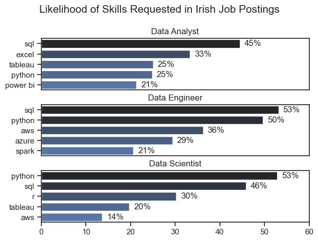
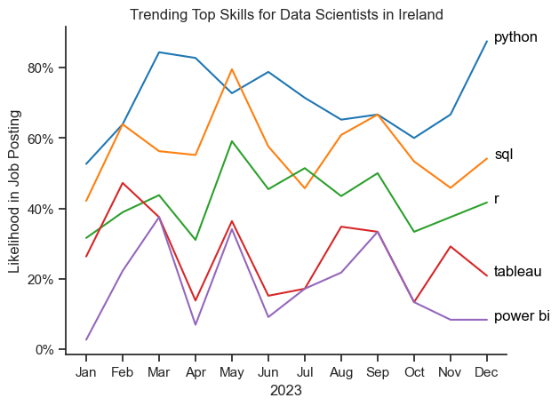

# The Analysis

## 1. What are the most demanded skills for the top 3 most popular data roles?

To find the most demanded skills for the top 3 most popular data roles, I filtered out those positions by which ones were the most popular, and got the top 5 skills for these top 3 roles. This query highlights the most popular job titles and their top skills, showing which skills I should pay attention to depending on the role I'm targeting.

View my notebook with detailed steps here:
[2_Skill_Demand.ipynb](3_Project\2_Skills_Count.ipynb)

### Visualise Data
````python 
fig, ax = plt.subplots(len(job_titles), 1)

for i, job_title in enumerate(job_titles):
    df_plot = df_skills_perc[df_skills_perc['job_title_short'] == job_title].head(5)
    sns.barplot(data=df_plot, x='skill_percent', y='job_skills', ax=ax[i], hue='skill_count', palette='dark:b_r')
    
plt.show()
````

### Results



### Insights

- Python is a versatile skill, highly demanded across all three roles, but most prominently for Data Scientists (53%) and Data Engineers (50%).
- SQL is the most requested skill for Data Analysts and Data Engineers, with it in over half the job postings across both roles. For Data Scientists, Python is the most sought-after skill, appearing in 53% of job postings.
- Data Engineers require more specialised technical skills (AWS, Azure, Spark) compared to Data Analysts and Daata Scientists who are expected to be proficient in more general data management and analysis tools (Excel, Tableau).


## 2. How are in-demand skills trending for Data Scientists?

### Visualise Data

```python

from matplotlib.ticker import PercentFormatter

df_plot = df_DA_IRE_percent.iloc[:, :5]
sns.lineplot(data=df_plot, dashes=False, legend='full', palette='tab10')

plt.gca()yaxis.set_major_formatter(PercentFormatter(decimals=0))

plt.show()

```

### Results


*Bar graph visualising the trending top skills for data scientists in Ireland in 2023.*

### Insights
- Python remains the most consistently demanded skill throughout the year.
- SQL experienced a significant decrease in demand starting around May but surpassed both R and Tableau by the end of the year.
- Both Tableau and and Power Bi show relatively similar demand throughout the year with some fluctuations but remain essential skills for data scientists. 